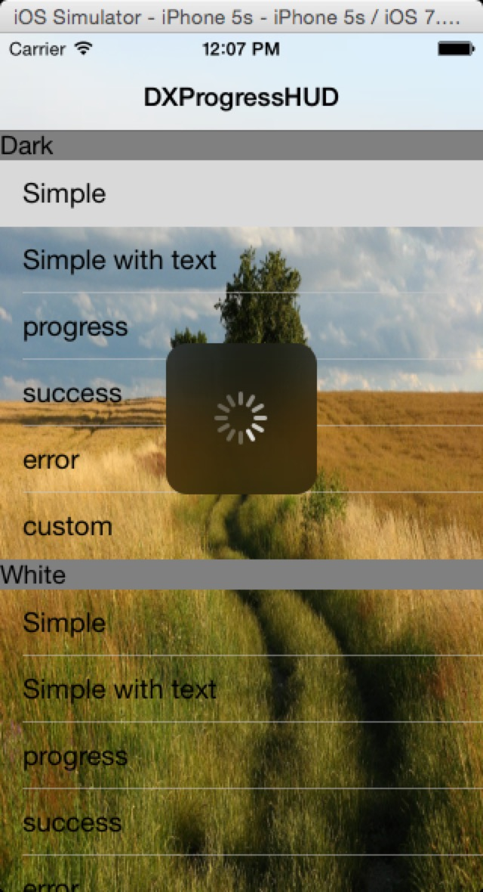
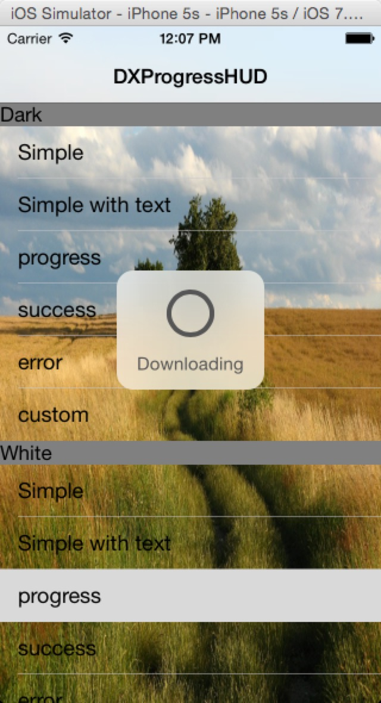

DXProgressHUD
=============

A UI improvement from SVProgressHUD

Thus it is 'subclass' from SVProgressHUD, all APIs are same.

Only one for you to custom the style

    + (void)setTranslucentStyle:(DXProgressTranslucentStyle)style;

Maybe useful add this api to control the time hud displaying

	+ (void)showImage:(UIImage *)image status:(NSString *)string duration:(NSTimeInterval)duration;
	

####Demo

